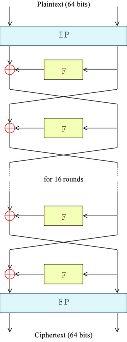
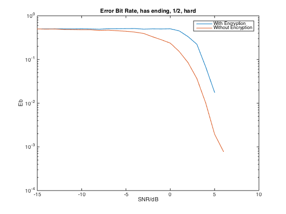
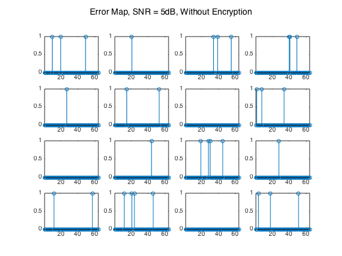
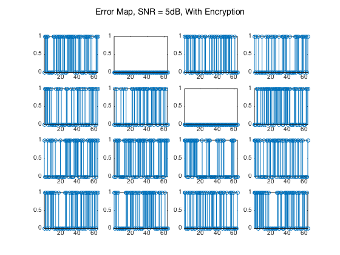

# 第二次编程练习 - 加解密

未说明时，数据均为列矢量。

## Part I

### 子密钥生成 `keygen`

- 输入
    - `key`: 64bits original key
- 输出
    - `subkeys`: 16 cells, each contains one 48bits subkey

## Part II

### 密码函数 `Feistel`

- 输入
    - `R`: Half Block（长度32，logical array）
    - `key`: 密钥（长度48，logical array)
- 输出
    - `feistel_out`: f(R, k)（长度32，logical array）

## Part III

### 加密 `encrypt`

- 输入
    - `data`: 输入数据流
    - `key`: 64 位密钥
- 输出
    - `encrypted`: 加密数据流

加密的过程如下：

1. 确保输入数据流长度为 64 的整数倍，若不是则在其后补零。
2. 初始置换 IP。
3. 使用子密钥和 f 函数迭代 16 次。
4. 尾置换 FP。

如图所示。

### 解密 `decrypt`

- 输入
    - `encrypted`: 加密数据流
    - `key`: 64 位密钥
- 输出
    - `data`: 解密后数据流

加密的过程如下：

1. 初始置换 IP。
2. 使用子密钥和 f 函数迭代 16 次，其中密钥的使用顺序与加密时相反。
3. 尾置换 FP。

可以看到，除了子密钥的使用顺序不同外，解密和加密几乎没有任何区别。

### 密钥生成 `create_key`

- 输入
    - `num`: 所需密钥数目，默认为 1
- 输出
    - `key`: `num` 个密钥，每列为一个 64 位密钥

使用 `randi` 函数生产一个 64 位的随机二进制序列。

### 主程序 `main`

- 计算误比特率。
- 以 64 bit 为单位，画出误码图案。

## 实验结果

### 误比特率

### 误码图案

可以看到，是否加密对误块率基本没有影响。但加密后，一旦有误码就会在块内扩散出大量的误码，使误比特率大大增加。这说明我们的加密算法确实能产生雪崩效应，是合格的。
