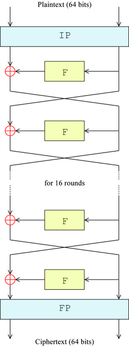
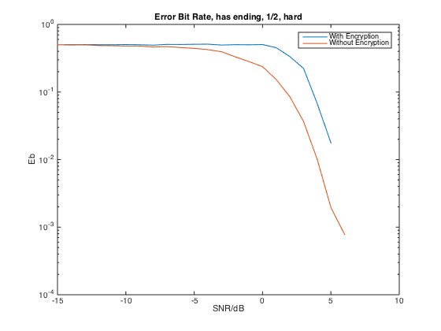

% 加解密试验
% 无36
  李思涵
  2013011187
  <lisihan969@gmail.com>
% \today

# API 设计 & 分工

我们组的成员如下：

- 2013011187 李思涵
- 2013011212 刘家硕
- 2013011166 陈馨瑶

我们将任务分成了三部分，其中我负责完成第三部分。

这次作业被托管在了 Github 上

<https://github.com/IntroductionOfCoding2015/encryption>

## Part I

### 子密钥生成 `keygen`

- 输入
    - `key`: 64bits original key
- 输出
    - `subkeys`: 16 cells, each contains one 48bits subkey

## Part II

### 密码函数 `Feistel`

- 输入
    - `R`: Half Block（长度32，logical array）
    - `key`: 密钥（长度48，logical array)
- 输出
    - `feistel_out`: f(R, k)（长度32，logical array）

## Part III

### 加密 `encrypt`

- 输入
    - `data`: 输入数据流
    - `key`: 64 位密钥
- 输出
    - `encrypted`: 加密数据流

加密的过程如下：

1. 确保输入数据流长度为 64 的整数倍，若不是则在其后补零。
2. 初始置换 IP。
3. 使用子密钥和 f 函数迭代 16 次。
4. 尾置换 FP。

如图所示。



### 解密 `decrypt`

- 输入
    - `encrypted`: 加密数据流
    - `key`: 64 位密钥
- 输出
    - `data`: 解密后数据流

解密的过程如下：

1. 初始置换 IP。
2. 使用子密钥和 f 函数迭代 16 次，其中密钥的使用顺序与加密时相反。
3. 尾置换 FP。

可以看到，除了子密钥的使用顺序不同外，解密和加密几乎没有任何区别。

### 密钥生成 `create_key`

- 输入
    - `num`: 所需密钥数目，默认为 1
- 输出
    - `key`: `num` 个密钥，每列为一个 64 位密钥

使用 `randi` 函数生产一个 56 位的随机二进制序列，并在每 7 位之后加入一个偶校验位。

### 主程序 `main`

- 计算误比特率。
- 以 64 bit 为单位，画出误码图案。

# 模块实现

以下列出了我负责部分的实现代码。

### 加密 `encrypt`

```
function encrypted = encrypt(data, key)
    IP = [58 50 42 34 26 18 10 2 ...
          60 52 44 36 28 20 12 4 ...
          62 54 46 38 30 22 14 6 ...
          64 56 48 40 32 24 16 8 ...
          57 49 41 33 25 17 9  1 ...
          59 51 43 35 27 19 11 3 ...
          61 53 45 37 29 21 13 5 ...
          63 55 47 39 31 23 15 7];
    FP = [40 8 48 16 56 24 64 32 ...
          39 7 47 15 55 23 63 31 ...
          38 6 46 14 54 22 62 30 ...
          37 5 45 13 53 21 61 29 ...
          36 4 44 12 52 20 60 28 ...
          35 3 43 11 51 19 59 27 ...
          34 2 42 10 50 18 58 26 ...
          33 1 41  9 49 17 57 25];

    % Pad data if needed.
    len = length(data);
    padding = ceil(len / 64) * 64 - len;
    data = [data; zeros(padding, 1)];

    subkeys = keygen(key);  % Generate sub-keys.

    for start_pos = 1:64:len
        range = start_pos:start_pos+63;
        block = data(range);

        block = fliplr(block(65 - IP));  % IP.

        left = block(33:64);
        right = block(1:32);

        for k = 1:16
            next_left = right;
            right = xor(left, Feistel(right, subkeys{k}));
            left = next_left;
        end

        block = [left; right];
        block = fliplr(block(65 - FP));  % FP.

        data(range) = block;
    end

    encrypted = data;
end
```

### 解密 `decrypt`

```
function data = decrypt(encrypted, key)
    IP = [58 50 42 34 26 18 10 2 ...
          60 52 44 36 28 20 12 4 ...
          62 54 46 38 30 22 14 6 ...
          64 56 48 40 32 24 16 8 ...
          57 49 41 33 25 17 9  1 ...
          59 51 43 35 27 19 11 3 ...
          61 53 45 37 29 21 13 5 ...
          63 55 47 39 31 23 15 7];
    FP = [40 8 48 16 56 24 64 32 ...
          39 7 47 15 55 23 63 31 ...
          38 6 46 14 54 22 62 30 ...
          37 5 45 13 53 21 61 29 ...
          36 4 44 12 52 20 60 28 ...
          35 3 43 11 51 19 59 27 ...
          34 2 42 10 50 18 58 26 ...
          33 1 41  9 49 17 57 25];

    len = length(encrypted);
    subkeys = keygen(key);  % Generate sub-keys.

    for start_pos = 1:64:len
        range = start_pos:start_pos+63;
        block = encrypted(range);

        block = fliplr(block(65 - IP));  % IP.

        left = block(33:64);
        right = block(1:32);

        for k = 1:16
            next_left = right;
            right = xor(left, Feistel(right, subkeys{17 - k}));
            left = next_left;
        end

        block = [left; right];
        block = fliplr(block(65 - FP));  % FP.

        encrypted(range) = block;
    end

    data = encrypted;
end
```

### 密钥生成 `create_key`

```
function key = create_key(varargin)
    % Determine the number of keys to be generated.
    if nargin == 0
        num = 1;
    else
        num = varargin(1);
    end

    key = zeros(64, num);

    for k = 1:num
        this_key = randi([0 1], 7, 8);
        this_key = [this_key; mod(sum(this_key), 2)];
        key(:, k) = this_key(:);
    end
end
```

### 主程序 `main`

```
addpath '../convolutional-coding/src'
load data
close all

EFFICIENCY = 2;
SNR = -15:1:15;
ITERS = 10;

key = create_key();

without_error_rate = zeros(size(SNR));
with_error_rate = zeros(size(SNR));

for k = 1:length(SNR)
    snr = SNR(k);
    disp([num2str(k) '/' num2str(length(SNR)) ': SNR = ' num2str(snr)]);

    for iter = 1:ITERS
        % Without encryption.
        signals = conv_send(data, true, EFFICIENCY, []);
        signals = transmit(signals, snr);
        recovered = conv_receive(signals, true, EFFICIENCY, [], true);

        err = xor(data, recovered);
        without_error_rate(k) = without_error_rate(k) + ...
                                sum(err) / length(data) / ITERS;

        % figure
        % for block = 1:16
        %     range = ((block - 1) * 64 + 1):(block * 64);
        %     subplot(4, 4, block);
        %     stem(err(range))
        %     axis([1 64 0 1])
        % end
        % suptitle(['Error Map, SNR = ' num2str(snr) 'dB, Without Encryption']);

        % With encryption.
        encrypted = encrypt(data, key);
        signals = conv_send(encrypted, true, EFFICIENCY, []);
        signals = transmit(signals, snr);
        encrypted = conv_receive(signals, true, EFFICIENCY, [], true);
        recovered = decrypt(encrypted, key);

        err = xor(data, recovered);
        with_error_rate(k) = with_error_rate(k) + ...
                             sum(err) / length(data) / ITERS;
        % figure
        % for block = 1:16
        %     range = ((block - 1) * 64 + 1):(block * 64);
        %     subplot(4, 4, block);
        %     stem(err(range))
        %     axis([1 64 0 1])
        % end
        % suptitle(['Error Map, SNR = ' num2str(snr) 'dB, With Encryption']);
    end
end

figure
semilogy(SNR, with_error_rate, SNR, without_error_rate);
title 'Error Bit Rate'
legend('With Encryption', 'Without Encryption');
xlabel 'SNR/dB'
ylabel 'Eb'
```

# 实验结果

## 误比特率

误比特率和信噪比的关系如图所示。可以看到，在经过了加密之后，数据的误比特率明显增大。这说明，信道噪声产生的较少错误，都会使接收端解码后的数据中产生大量的错误。这个雪崩效应的定义看起来是反的，但由于我们的加密算法是可逆的，从密文到明文的雪崩效应实际上和从明文到密文的一样。

实际上，这一点可以使信道更加安全。因为窃听者的信道质量一般较差，故解码后的数据很有可能出现大量的错误，从而达到了阻止窃听者获取信息的目的。



## 误码图案

如图所示。可以看到，是否加密对误块率基本没有影响。但加密后，一旦有误码就会在块内扩散出大量的误码，使误比特率大大增加。这说明我们的加密算法确实能产生雪崩效应，是合格的。不过，这种雪崩效应被限制在了长为 64 的块中，可能会影响加密的效果。


