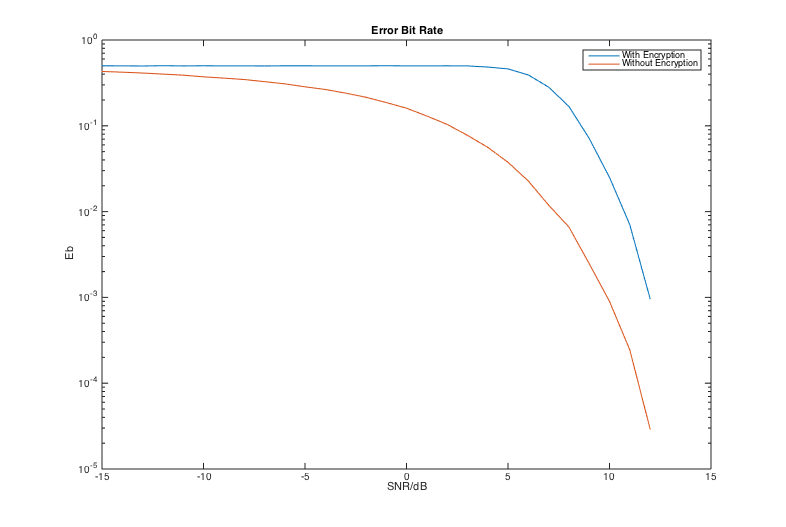
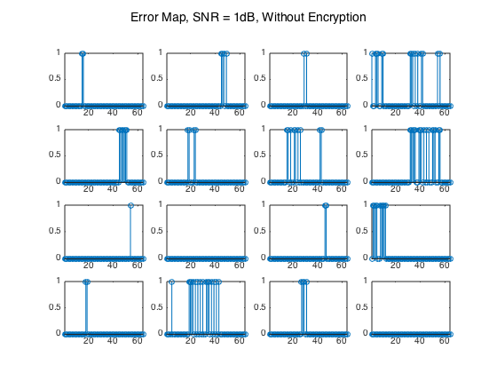
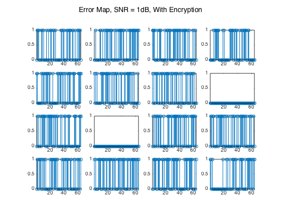

##加密解密

####无37

####刘家硕

####2013011212

---

###Part I API

采用DES加解密标准，依照课外搜集材料实现了比较标准的整个流程，代码中部分PC矩阵来自网络，非原创设计（使得整个过程更加标准化）。

1. 子密钥生成

    函数：`keygen`

    + input：

        `key`：64bits key

    + output：

        `subkeys`: 16 cells, each contains one 48bits subkey

    64bits中每个byte末是一个奇偶校验位，故只有56bits有效原始密钥，分成两部分，循环移位后从每部分选24bits组合输出各个subkey。

2. 密码函数

    函数：`Feistel`

    + input：

        `R`：Half Block（长度32，logical array）

        `key`：密钥（长度48，logical array)

    + output：

        `feistel_out`：f(R, k)（长度32，logical array）

3. 整体加解密与联调

    函数：`encrypt`

    + input：

        `data`：输入数据流

        `key`：64位密钥

    + output：

        `encrypted`：加密数据流

    函数：`decrypt`

    + input：

        `encrypted`：加密数据流

        `key`：64位密钥

    + output：

        `data`：解密后的数据流

    函数：`create_key`

    + input：

        `num`：所需密钥数目，默认为1

    + output：

        `key`：num个密钥，每列为1个64位密钥

    函数：`main`

    功能：

    + 计算误比特率

    + 以64bits为单位，画出误码图案

---

###Part II 功能实现

这次我负责的内容比较少（整体内容也比较少），只负责了由密钥生成子密钥的部分，这部分上课没有详细介绍，主要通过网络搜集了大部分知识，依照已有的标准进行了代码实现，并没有加入过多的原创内容。

对64bits的原始输入（包含8bits奇偶校验位），首先要经过一次 permutated choice，对有效的56bits进行一次换位，矩阵为标准化的矩阵，对应代码中的 PC1。

之后将56bits分成两部分，每部分在每次循环中做循环移位，再经 PC2 的选择输出为一个 subkey，一共循环16次，产生16个48bits字密钥。

每次循环移位的位数列写在 shiftbits 中。

列写我负责部分的代码

`keygen`

```matlab
function subkeys = keygen( key )

subkeys = cell(1,16);

PC1 = [...
    57 49 41 33 25 17 9 ...
    1 58 50 42 34 26 18 ...
    10 2 59 51 43 35 27 ...
    19 11 3 60 52 44 36;
    63 55 47 39 31 23 15 ...
    7 62 54 46 38 30 22 ...
    14 6 61 53 45 37 29 ...
    21 13 5 28 20 12 4];
PC2 = [...
    14 17 11 24 1 5 3 28 ...
    15 6 21 10 23 19 12 4 ...
    26 8 16 7 27 20 13 2 ...
    41 52 31 37 47 55 30 40 ...
    51 45 33 48 44 49 39 56 ...
    34 53 46 42 50 36 29 32];
shiftbits = [1 1 2 2 2 2 2 2 1 2 2 2 2 2 2 1];

C = key(PC1(1,:))';
D = key(PC1(2,:))';

for round = 1:16
    C = [C(1+shiftbits(round):end), C(1:shiftbits(round))];
    D = [D(1+shiftbits(round):end), D(1:shiftbits(round))];
    raw_subkey = [C,D];
    subkeys{round} = raw_subkey(PC2)';
end

end
```

---

###Part III 实验结果及分析

1. 误比特率

    

    图为误比特率和信噪比的关系在有加密与无加密两种情况下的对比。

    + 从图中可以看出有加密的情况下误比特率随信噪比增大而急速下降的转折点到来要晚一些，但趋势更快；

    + 这一点证明了加解密对信道安全有积极作用，当监听者从较差的信道中截获信息时很可能因为信道造成的少量误比特导致解密后大量的误比特。

2. 误码图案

    

    

    都是在5dB信噪比下，有无加解密的误码图案的对比

    + 能很清晰地观察出雪崩效应的存在，未加密时少量的误码在加密后变成大量误码。
